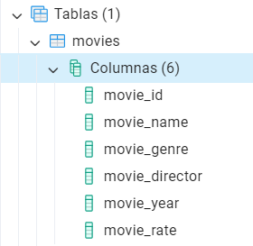

## Pràctica 2 - M07 UF2
### Autor: Adrià García

#### Exercici:

1. Crear varis arxius per fer les operacions CRUD sobre una taula que caldrà crear amb un altre arxiu fent servir ***Python***.
    - Arxius que hi hauran:
        - **main.py** (on es gestionaran totes les peticions del client)
        - **create.py**
        - **read.py**
        - **update.py**
        - **delete.py**
        - **connection.py**
        - **create_table.py** (ha de ser una taula de la temàtica que es vulgui amb 6 camps)

### <ins>CAPTURES
### Creació de taula:
### <ins>CREATE TABLE

### Operacions CRUD:

### <ins>CREATE (INSERT)

### <ins>READ (SELECT)

### <ins>UPDATE (UPDATE)

### <ins>DELETE (DELETE)

